# Welcome to the Mass Effect 1 Planet Tracker!

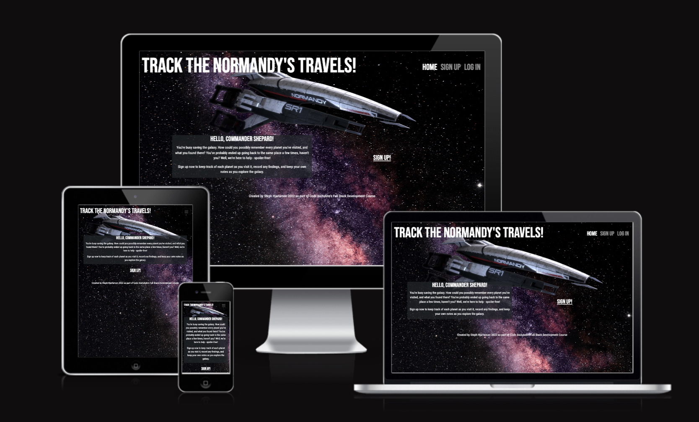

The purpose of this site is to help Mass Effect 1 (ME1) players track which planets they have visited or scanned, and log any discoveries they've made there. 

As someone who just played ME1 for the first time, one of the pieces of functionality I missed was a way to keep track of systems and planets I'd visited. In Mass Effect 2, each system is labelled with a percentage, telling you how much of that system you've visited. All unvisited planets are also clearly labelled. Unfortunately, this does not exist in ME1, so I (along with many other players) resorted to using a pen and a notepad. This was very manual, and involved a lot of flipping pages and rereading lists to see if I'd been to a particular planet before - there are 39 systems in the game, and each one has 3-6+ planets, so it's hard to remember them all!

The alternative was to download a checklist created by other players, with a list of all planets you can visit or scan and what you can find on each one, checking off the list as you go. However, this spoiled the surprise - I didn't want to know what I could find where!

The planet tracker allows players to sign up for an account, and create a personal list of visited planets as they play through the game. The user can check off items they've discovered on each planet (like Asari Writings, Valuable Minerals, or Prothean Data Discs) without knowing they're there ahead of time. There is also a free text "Notes" section for any reminders or notes the user would like to write (for example, a reminder to revisit a planet, or complete a specific side quest).

The site is fully responsive, so users can play the game on desktop or console, and have their phone or tablet next to them open to the Planet Tracker while they play. 

For more information about Mass Effect, please check out the [Mass Effect Wiki](https://masseffect.fandom.com/wiki/Mass_Effect_Wiki).

See the deployed site here: [ME1 Planet Tracker](https://me1-planet-tracker.herokuapp.com/).

## User Experience

### User Stories
As I began planning and ideating this project, I broke down the functionality of the project into Epics and User Stories as below:

**Epic: Account Management**

**User Stories**:
- As a **user** I can **sign up for an account** so that I can **track the planets I have visited**
- As a **user** I can **log in and out of my account** so that **I can access my 'visited planets' dashboard**
- As a **user** I can **set a profile photo** so that **I can customize my version of Commander Shepard to match the character in the game**
- As a **user** I can **request to reset my password via email** so that **I can log back in to my account if I don't remember my login details**
- As a **user** I can **delete my account** so that **my details are deleted when I have finished playing the game, or don't want to use the tracker anymore**
- As a **user** I can **update my email address or password** so that **I can keep my account secure and up to date**

**Epic: Managing the Planet Dashboard**

**User Stories**: 
- As a **user** I can **add a visited planet to my dashboard** so that **I can keep track of all planets and what I found there**
- As a **user** I can **edit my visited planets** so that **I can make changes as I make more discoveries, or fix mistakes**
- As a **user** I can **delete planets** so that **I can remove any planets I added by mistake, or that I may want to revisit**
- As a **user** I can **view my visited planet list** so that **I can see which planets I have visited and what I found there**
- As a **user** I can **see the percentage of planets I have visited at a glance** so that **I understand how much progress I have made in the game**
- As a **user** I can **upload an image to each planet's card** so that **I can customize my dashboard and record images of every planet I've visited**

**Epic: Admin Capabilities**

**User Stories**:
- As a **site admin** I can **track the number of users and the number of planets visited by each user** so that **I can share this information on the home page, and award progress badges to users**
- As a **site admin** I can **create and edit the list of planets users can choose from** so that **only planets from Mass Effect 1 can be added to users' dashboards**

**Epic: Rewards & Badges**

**User Stories**:
- As a **user** I can **win a badge when I visit a certain number of planets** so that **I feel a sense of accomplishment and progress as I add planets to my dashboard**
- As a **user** I can **see previous badges I have won** so that **I can look back at the progress I have made**
- As a **site admin** I can **award badges to users when they visit a certain number of planets** so that **users will feel accomplished and stay engaged with the site**
- As a **user** I can **see statistics on the home page that display how many users have visited 25%, 50%, 75%, and 100% of planets** so that **I can feel motivated and compare my own progress to other users'**

These user stories are being tracked using GitHub Projects, and tagged as either Must Have (features which the site requires in order to function), Should Have (features which the site should have in order to be fully functional, but could still run without), and Nice To Have (features which are not necessary for the functionality of the site, but would improve the user experience). See a screenshot below:

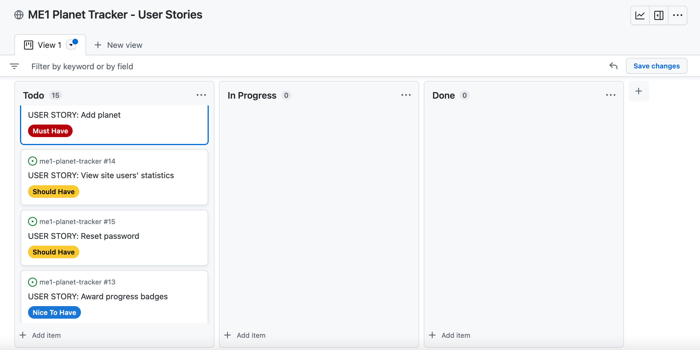

### Wireframes
During the design stage of the project, I created wireframes for desktop, tablet, and mobile versions of the site:

- [Desktop](static/readme/WireframesDesktop.pdf)
- [Tablet](static/readme/WireframesTablet.pdf)
- [Mobile](static/readme/WireframesMobile.pdf)

### Entity Relationship Diagram
I have also created an Entity Relationship Diagram (ERD) showing the relationship between the Planets model (a custom model which stores all the information entered by the user relating to a specific planet on their dashboard) and the User model (imported from Django):

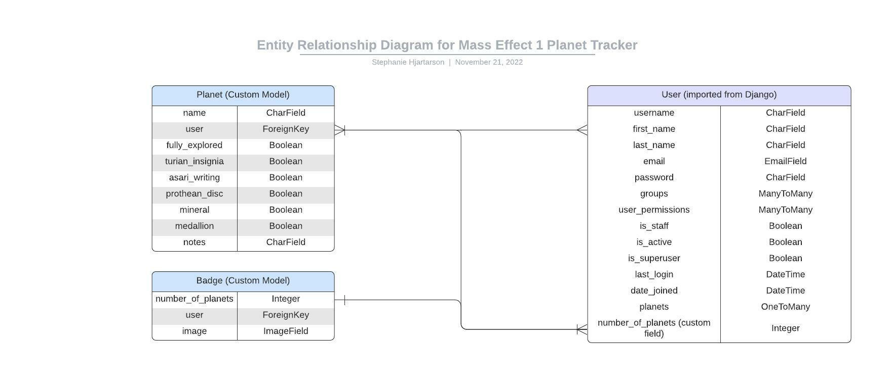

## Features 

### Existing Features

- __Navigation Bar__
  - The header and navigation bar appear consistently across all pages of the site. I chose the font because it looks clear and clean, while also being a bit futuristic with very crisp lines & edges. The nav bar is fully responsive across all screen sizes, as seen below: 

  
  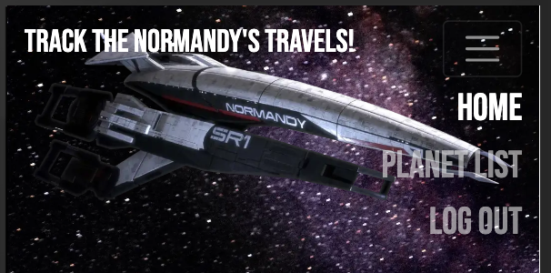

- __The Landing Page__
  - The landing page features a landing image of the starship Normandy (the main spaceship featured in the game Mass Effect). I chose a dark starry background to represent the fact that much of the game involves space travel. There is a short paragraph explaining the purpose of the site, and a featured link depending on the user's status: logged in users will see a link to their planet dashboard, and users who are not logged in will see a link to sign up.

  
  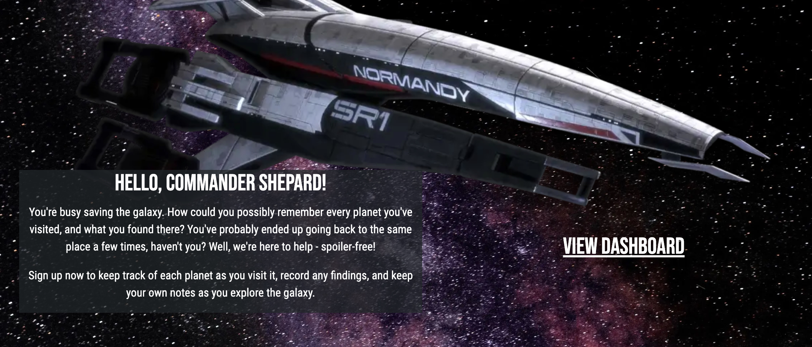

- __The Sign Up Page__
  - The sign up page allows the user to sign up for an account. It also provides a link redirecting them to the login page if they have already registered for an account.

  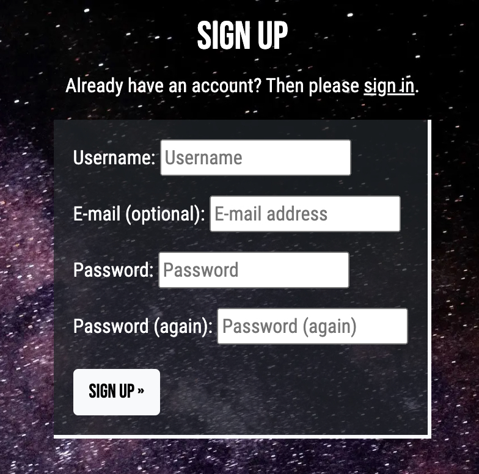

- __The Login Page__
  - The login page allows the user to log into their account. It also offers a 'Remember Me' option, so that the user does not have to re-enter their login details the next time they return to the page. Similarly to the sign up page, there is a link redirecting the user to sign up for an account if they have not already registered.

  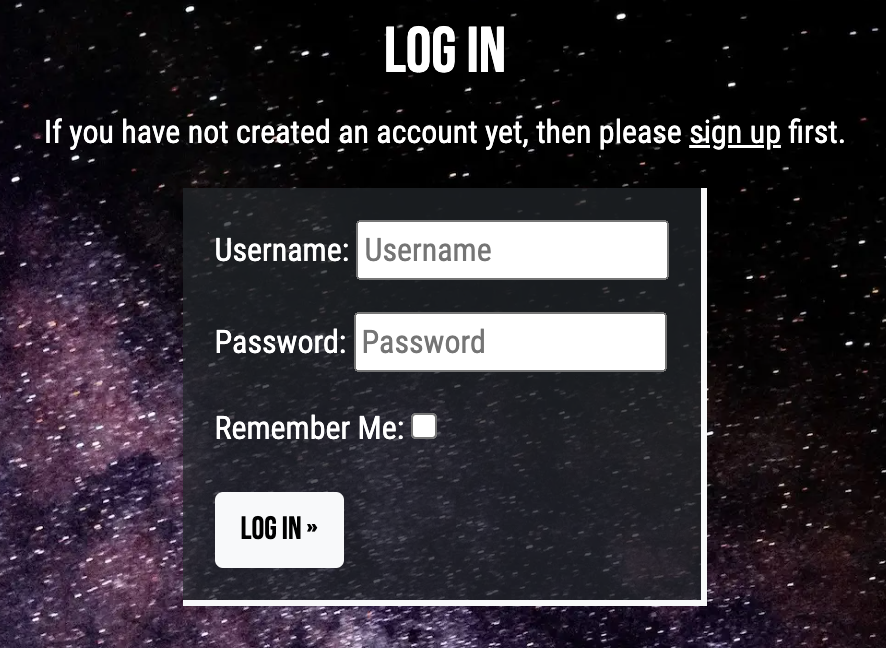

- __Planet Dashboard__
  - The planet dashboard is the main function of the website. It allows users to view all the planets they have logged, what they found on each planet (indicated by a green tick for items discovered, and a red x for items that were not discovered on that planet), and free text notes. Each planet's card also logs when the planet was first discovered, and when it was last edited. The planets are displayed in order from most recently edited to oldest. The planet dashboard is paginated, so a new page is created for every 8 planets. This prevents the page from becoming too long or unwieldy to navigate.

  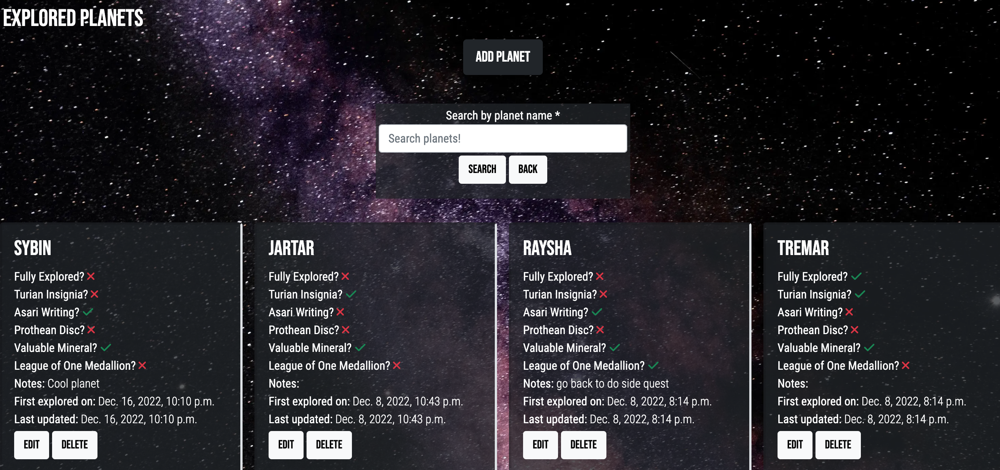

- __Planet Search Bar__
  - Another main feature of the planet dashboard is the planet search bar. This allows the user to search their existing list of planets, to see if they have already added a planet to the list. If the search returns no results, it will prompt the user to check their spelling, and let them know they have not explored any planets by that name. 

  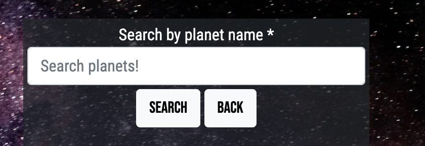

- __Add Planet Form__
  - This form allows users to add a new planet to their dashboard. The only mandatory field is the name field, and the user must select from a pre-populated list of all the planets that appear in the game Mass Effect. All other fields are optional, as the user should select which items they discovered on each planet, and they only need to make notes if they choose to. The form also includes a back button so the user can return to the previous page without adding a planet.

  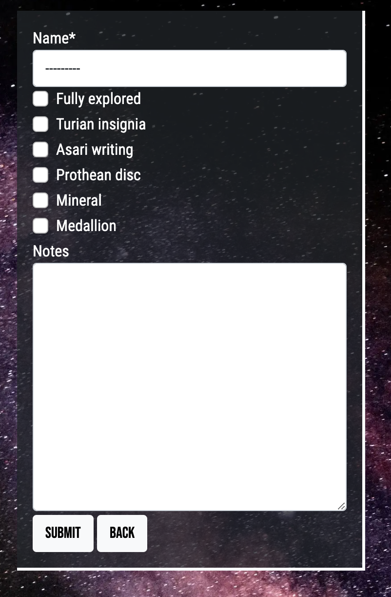

- __Edit Planet Form__
  - This is similar to the add planet form: it allows users to edit planets that have already been added to their dashboard. The form comes pre-loaded with the selections the user made when they first added the planet to their dashboard, as well as any notes they added. The planet's name cannot be edited. The form also includes a back button so the user can return to the previous page without editing the planet.

  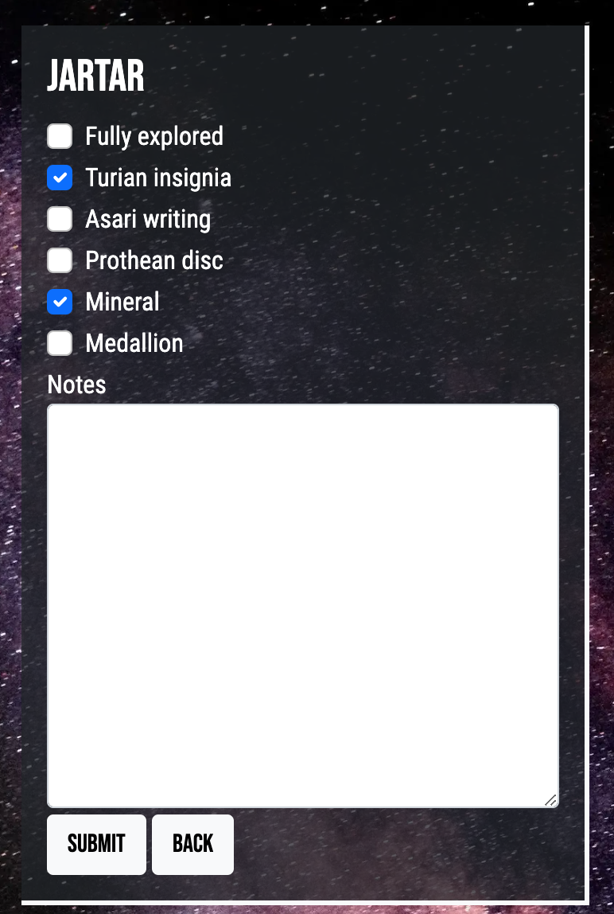

- __Delete Planet Form__
  - This page allows users to delete a planet from their dashboard. After they click *Delete* on the planet's card, they are brought to this page which reconfirms that they would like to delete the planet. The user must confirm again that they wish to delete the planet from their tracker. The form also includes a back button so the user can return to the previous page without deleting the planet.

  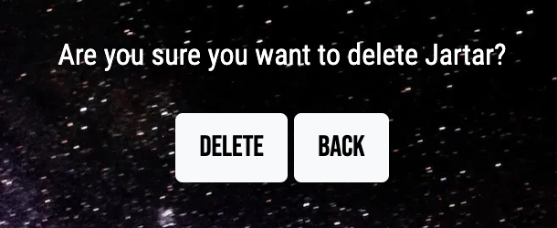

- __Sign Out Page__
  - This page confirms with the user that they would like to sign out, after pressing *Sign Out* on the nav bar. The page also includes a back button, so they can return to the previous page without signing out. 

  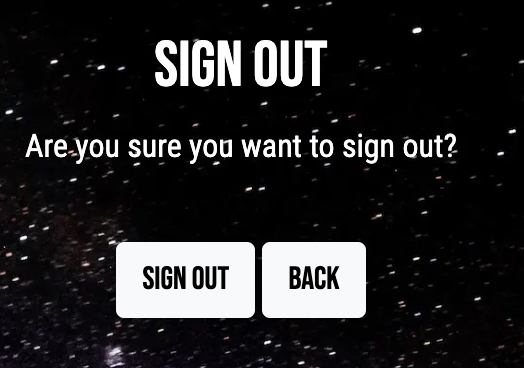

- __Validation Messages__
  - A validation message appears every time a user takes one of the following actions: signing in, signing out, adding a planet, editing a planet, and deleting a planet. The styling is the same for all messages, and provide feedback to the user that their action has been successful. Here is an example:

  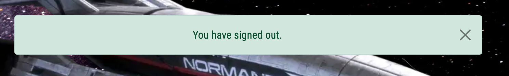

### Features Left to Implement

- All "Must Have" features were completed for this project, and the Should Have and Nice To Have features remain on the [project board](https://github.com/users/StephHjar/projects/5) as features to be added.

## Testing 

Please see the [Testing file](TESTING.md) for automated, manual, and validator testing.

## Deployment
​
### Local Deployment
​
*Gitpod* IDE was used to write the code for this project.

To preview the project in the development environment, run the following command in the terminal:
```python3 manage.py runterminal```. This will open port 8000. Click *Open Browser* when the popup window appears.

To make a local copy of this repository, you can clone the project by typing the follow into your IDE terminal:
- `git clone https://github.com/StephHjar/me1-planet-tracker.git`

Alternatively, if using Gitpod, you can click below to create your own workspace using this repository.

[](https://gitpod.io/#https://github.com/StephHjar/me1-planet-tracker)

### Preparing File for Deployment

If you have not already set up Postgres for use in the deployed application, complete the following steps:

- In the terminal, type `pip3 install psycopg2-binary` and press enter.
- Install gunicorn, which will act as the web server. Type `pip3 install gunicorn` in the terminal and press enter.
- You can install this project's requirements (where applicable) using: `pip3 install -r requirements.txt`. If you have your own packages that have been installed, which I did, then the requirements file needs to be updated using: `pip3 freeze --local > requirements.txt`:
  - In the terminal, type `pip3 freeze --local > requirements.txt`. This will create or update a file called `requirements.txt`, with a list of all the packages that Heroku will need to install to run our app.
- Create a Procfile in the root folder of your project, and add the following to the Procfile: `web: gunicorn <app_name>.wsgi:application`.

​
### ElephantSQL Deployment

To host my database, I used ElephantSQL. 

The instructions to create a new account can be[found here](https://code-institute-students.github.io/deployment-docs/02-elephantsql/elephantsql-01-sign-up), provided by Code Institute. 

Once you have created an account:
- Log in to ElephantSQL to access your dashboard.
- Click *Create New Instance*.
- Give your plan a name (usually the name of the project, in this case *ME1 Planet Tracker*).
- Select the Tiny Turtle (Free) plan.
- Leave the Tags field blank.
- Click *Select Region* and choose a data center near you.
- Click *Review*, then, if everything looks correct, *Create Instance*.
- Go back to your dashboard and click on the name of the project. 
- Copy the database URL for your project, and use it in two places:
  - In your `env.py` file, create a new key called `DATABASE_URL` and give it the value of the ElephantSQL database URL, as follows: ` os.environ.setdefault("DATABASE_URL", "my_copied_database_url")`.
    - Before deploying the project, create a file called `env.py` (if it hasn't been created already), and complete the following steps:
      - In `settings.py`: At the top of the file, add the following import:
      ```python
      import os

      if os.path.isfile("env.py"):
          import env
      ```
      - Replace the pasted-in database url with the following code:
      ```python
      os.environ.get("DATABASE_URL")
      ```
  - Paste the database URL into the config vars section of your project on Heroku - instructions are in the *Heroku Deployment* section below. 

After the above steps are completed, install dj-database-url to your project, by typing the following command in the terminal and pressing enter:
- `os.environ.setdefault("DATABASE_URL", "my_copied_database_url")`
- Then update `requirements.txt` by typing `pip3 freeze --local > requirements.txt`.

### Heroku Deployment
​
This project uses [Heroku](https://www.heroku.com), a platform as a service (PaaS) that enables developers to build, run, and operate applications entirely in the cloud.

To set up an account:

- Go to [heroku.com](https://www.heroku.com) to register for a free account.
- For my account, I set my *Role* as *Hobbyist* and *Primary development language* as Python.
- Click *Create free account*.

I used the [Code Institute Gitpod Full Template](https://github.com/Code-Institute-Org/gitpod-full-template) for this project, which hmeans the Heroku command line interface (CLI) came pre-installed. Please check the [Heroku documentation](https://devcenter.heroku.com/articles/heroku-cli) for the most up-to-date installation instructions. 

To log in to the Heroku CLI:

- In the terminal, type ```heroku login -i``` and press enter.. 
- Enter your username and password in the terminal.
- If you have Multi-Factor Authentication turned on:
  - Click on Account Settings (via the avatar menu) on the Heroku Dashboard.
  - Scroll down to the API Key section and click Reveal. Copy the key.
  - Use the login command: heroku login -i
  - Enter your Heroku username.
  - Enter the API key you just copied when prompted for your password.

Deployment steps are as follows, from the Heroku dashboard:
​
- Select *New* in the top-right corner of your Heroku Dashboard, and select *Create new app* from the dropdown menu.
- Enter a name for your app. The app name must be unique, so you need to adjust the name until you find a name that hasn't been used.
- From the dropdown, choose the region closest to you (EU or USA), and finally, select *Create App*.
- From the new app *Settings*, click *Reveal Config Vars*, and set the value of KEY to `PORT`, and the value to `8000` then select *add*.
- Add another Config Var with the KEY set to `DATABASE_URL` and the value to the ElephantSQL database URL you copied above.
- I added additional Config Vars for the folowing:
  - `CLOUDINARY_URL` copied from my [Cloudinary](https://cloudinary.com/) dashboard, because I used Cloudinary to host my static files.
  - `SECRET_KEY` which contains my secret key (also included in `env.py`).
  - `HEROKU_POSTGRESQL_COBALT_URL` with my Heroku postgres database URL. 

For Heroku deployment, follow these steps to connect your GitHub repository to the newly created app:
​
- At the top of the screen on Heroku, select *Deploy*.
- Next to *Deployment method* select *GitHub*, then scroll down and click *Connect to GitHub* to confirm you want to connect.
- In the *repo-name* field, search for the name of the GitHub repository to deploy, and click *Search*.
- Click *Connect* to link the GitHub repository with Heroku. 
- Scroll down to the *Manual deploy* section, and click *Deploy Branch*.
- If you like, click *Enable Automatic Deploys* in the *Automatic deploys* section to have Heroku rebuild your app every time you push a new change to GitHub.

Once the project is deployed, you will need to add the project's URL to your `ALLOWED_HOSTS` in `settings.py`, using the following code:
- `ALLOWED_HOSTS = ['<project_url>']`
In my case this looks like this:
- `ALLOWED_HOSTS = ['me1-planet-tracker.herokuapp.com']`

Push this update to GitHub, and the project should now be deployed and live on Heroku. 

## Credits 

### Content 

- [Code Institute's Gitpod Full Template](https://github.com/Code-Institute-Org/gitpod-full-template) was used as the starting workspace template for this project.
- [Code Institute's README Template](https://github.com/Code-Institute-Solutions/readme-template) was used to structure this README.
- [Balsamiq](https://balsamiq.com/) to create wireframes during the design phase.  
- [Lucidchart](https://lucid.app/) to create the Entity Relationship Diagram.
- The navigation bar was modified from [Bootstrap's documentation](https://getbootstrap.com/docs/5.1/components/navbar/).
- [This thread](https://stackoverflow.com/questions/63948287/bootstrap-5-navbar-align-items-right) on StackOverflow helped with aligning the nav bar items to the right of the page.
- I used [this article](https://mdbootstrap.com/how-to/bootstrap/text-responsive/#:~:text=You%20can%20make%20text%20responsive,%3D%201%25%20of%20viewport%20width.) on MDBootstrap to make the h1 text responsive.
- I used [this article](https://5balloons.info/how-to-align-content-vertically-inside-a-div-in-bootstrap-5#:~:text=Align%20%2F%20Center%20content%20Vertically,the%20middle%20of%20the%20div.) on 5balloons to vertically and horizontally align text in a div using Bootstrap.
- I used the following articles while researching how to populate a list of planets in the 'name' value of my Planet model:
  - [Django documentation on field choices](https://docs.djangoproject.com/en/4.1/ref/models/fields/#field-choices)
  - [This thread](https://stackoverflow.com/questions/25169372/how-to-make-a-long-list-of-choices-for-a-charfield-in-django) on StackOverflow gave me the idea of loading the list from a separate .txt file.
  - [This article](https://www.geeksforgeeks.org/how-to-split-a-file-into-a-list-in-python/) on GeeksForGeeks for inspiration on how to convert the raw text file into a list.
  - [This thread](https://stackoverflow.com/questions/46872329/django-migration-error-errors-choices-must-be-an-iterable-e-g-a-list-or-t) on StackOverflow helped me to link the PLANET_CHOICES list to my model correctly. 
- The 'LoginRequiredMixin section of [Django's documentation](https://docs.djangoproject.com/en/4.1/topics/auth/default/) was used to set up the class-based view for planet_list.html. This ensure that a user has to be logged in to access the page, and that they can only see the planets that they have added to the database.
- I used [this thread](https://stackoverflow.com/questions/56604833/django-if-table-in-template-is-empty-display-something-else) on StackOverflow to add a message to my planets_list.html page if the list of planets is empty.
- [This thread](https://stackoverflow.com/questions/4172448/is-it-possible-to-break-a-long-line-to-multiple-lines-in-python) on StackOverflow helped me include line breaks in long lines of Python code.
- I used the following articles while researching how to display only a user's own planets to them when logged in, and have them add planets to only that list:
  - [This thread](https://stackoverflow.com/questions/64916109/how-to-access-a-logged-in-user-from-a-class-based-view) on StackOverflow showed me how to define the logged in user in a class-based view.
  - [This thread](https://stackoverflow.com/questions/72034201/how-to-populate-user-field-with-current-user-in-django-models-via-forms) on StackOverflow helped me automatically populate the logged-in user in the 'user' field of the "Add Planet" form, when adding a new planet.
  - [This article](https://www.geeksforgeeks.org/createview-class-based-views-django/) on GeeksForGeeks helped with using a CreateView class-based view for my "Add Planet" form.
  - [This thread](https://stackoverflow.com/questions/10382838/how-to-set-foreignkey-in-createview) on StackOverflow helped me with using the form_valid method as part of CreateView.
  - [This thread](https://stackoverflow.com/questions/6266415/django-class-based-generic-view-no-url-to-redirect-to) on StackOverflow showed me how to redirect the user back to the planet list after successfully adding a planet.
- [This page](https://www.pythontutorial.net/django-tutorial/django-deleteview/) on PythonTutorial.net helped me create my DeleteView.
- I used some of the answers on [this StackOverflow thread](https://stackoverflow.com/questions/9793576/how-to-render-menu-with-one-active-item-with-dry) to mark the current page as active in my nav bar. 
- I used [this tutorial](https://www.geeksforgeeks.org/updateview-class-based-views-django/) on GeeksForGeeks to modify my EditView.
- I used the [Django documentation on messages](https://docs.djangoproject.com/en/4.1/ref/contrib/messages/) and the [Bootstrap documentation on alerts](https://getbootstrap.com/docs/5.0/components/alerts/) to add and style success / error messages.
- [This thread on StackOverflow](https://stackoverflow.com/questions/24822509/success-message-in-deleteview-not-shown) helped me add a success message when a planet is deleted.
- I used [django-search-views](https://pypi.org/project/django-search-views/) to add search functionality to the planet list page.
- [This thread](https://stackoverflow.com/questions/3248682/how-to-get-url-of-current-page-including-parameters-in-a-template) on StackOverflow was helpful in displaying a different message to the user if they haven't added any planets to their tracker yet, vs. if their search comes back empty ('search' in the URL).
- The code for the password validation was modified from [this page](https://www.javatpoint.com/confirm-password-validation-in-javascript) on JavaTPoint. 
- To help write my Jest tests, I had [a conversation](static/readme/chatGPT-transcript-1.pdf) with the [ChatGPT AI](https://chat.openai.com/). The code had to be adjusted, but this helped me create a mock window alert, which allowed my tests to run.
- Code Institute's "I Think Therefore I Blog" module helped me to write unit tests for my forms, models, and views. 
- I used several resources to figure out how to structure the test for my PlanetList view, because it has a LoginRequiredMixin:
  - [This thread on StackOverflow](https://stackoverflow.com/questions/40472094/django-secure-ssl-redirect-and-301-http-responses#42350975) showed me how to add ```follow=True``` and ```secure=True``` to the ```self.client.post``` request.
  - [This thread on StackOverflow](https://stackoverflow.com/questions/62239228/writing-unit-test-for-my-class-based-views-which-also-require-loginrequiredmixin) provided additional clarifiaction around how to test templates with the LoginRequiredMixin, and 302 vs 200 codes. 
  - [This thread on StackOverflow](https://stackoverflow.com/questions/2619102/djangos-self-client-login-does-not-work-in-unit-tests) was helpful with importing and using Client to mock a logged in user.
  - [This thread on StackOverflow](https://stackoverflow.com/questions/71132138/object-has-no-attribute-when-running-testcase) helped me actually implement a logged in user within the test.
  - [This thread on Reddit](https://www.reddit.com/r/djangolearning/comments/dfcul2/django_testing_responsetemplates_returns/) led me to ```assertRedirects```.
  - [This thread on StackOverflow](https://stackoverflow.com/questions/47020253/django-testing-how-to-assert-redirect) was helpful with actually implementing ```assertRedirects```.
- [This thread on StackOverflow](https://stackoverflow.com/questions/66349868/jest-unit-testing-module-export-error-in-browser-console) helped me resolve a console error due to the ```module.exports``` in my JavaScript file.
- Some deployment instructions are from Code Institute's 'Deployment' section, in the 'Hello Django' module of the course..

### Media

- [Favicon.io](https://favicon.io/) was used to create the Favicon.
- The image for the Favicon is from the [Mass Effect Wiki](https://masseffect.fandom.com/wiki/N7).
- The background image is by Enric Cruz López on [Pexels](https://www.pexels.com/photo/universe-filled-with-stars-nebula-and-glowing-milky-way-6039245/).
- The image of the Normandy on the home page is from the [Mass Effect Wiki](https://masseffect.fandom.com/wiki/SSV_Normandy).
- Icons on the planet dashboard are from [FontAwesome](https://fontawesome.com/).
- The responsive mockup was created on [Am I Responsive?](https://ui.dev/amiresponsive).
- I used [CloudConvert](https://cloudconvert.com/) to convert images to webp format.
- I used [TinyPNG](https://tinypng.com/) to compress my images.

### Acknowledgements

- Thank you to my mentor, Narender Singh, for the guidance and advice on this one! 
- And a special thank you to my partner Jonathan, for testing the site, reviewing my README, and being the best support I could ask for.