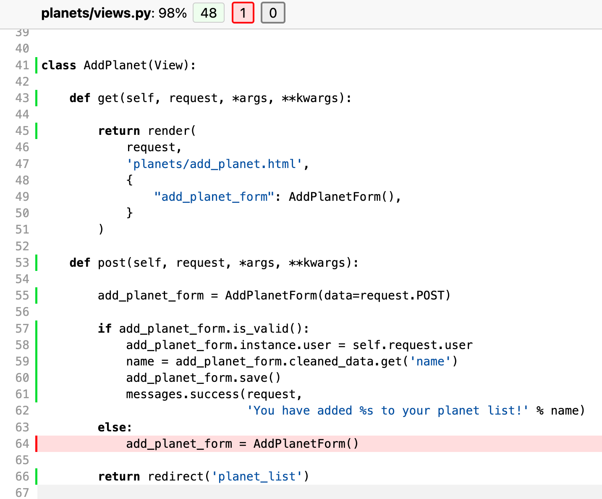
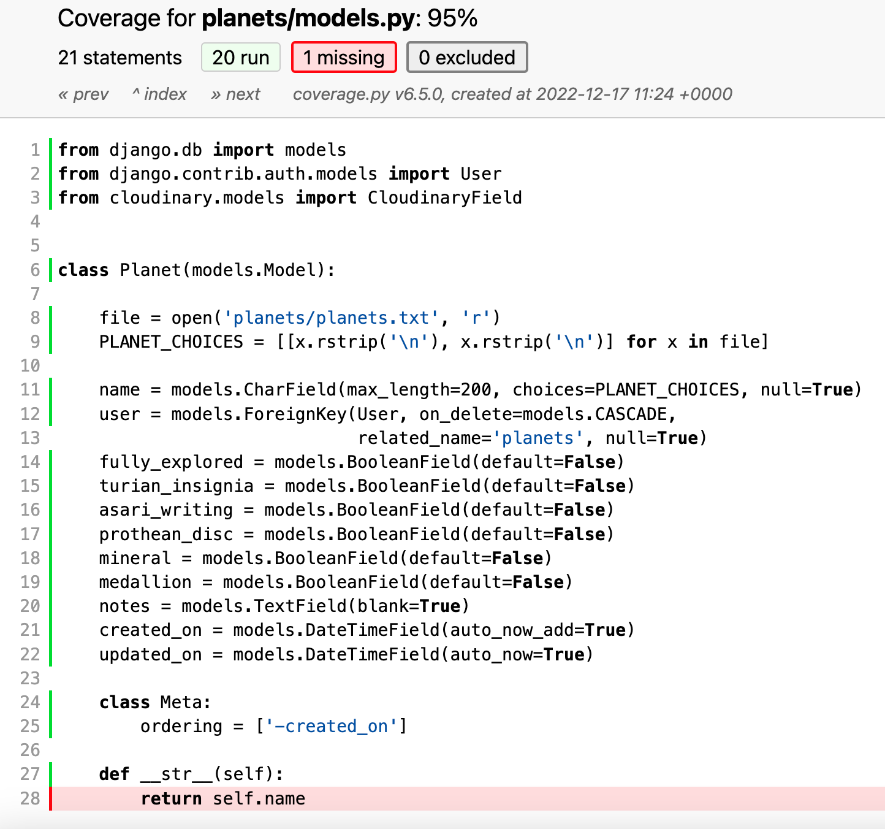
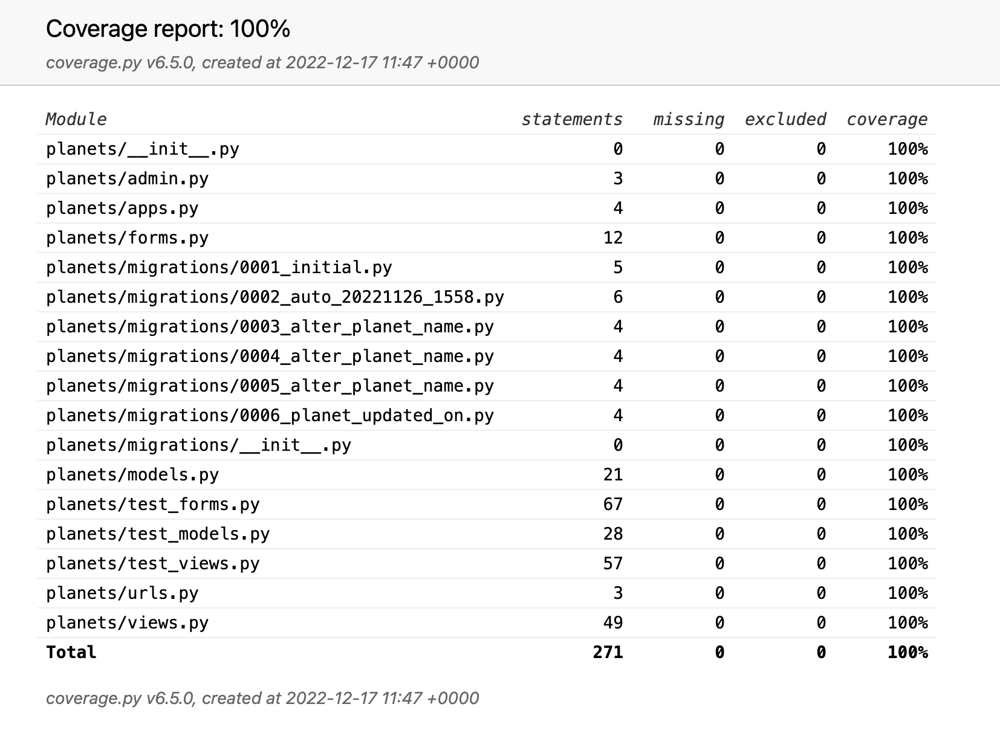
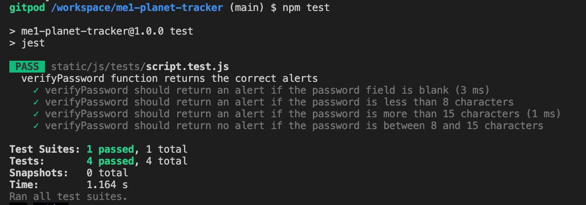
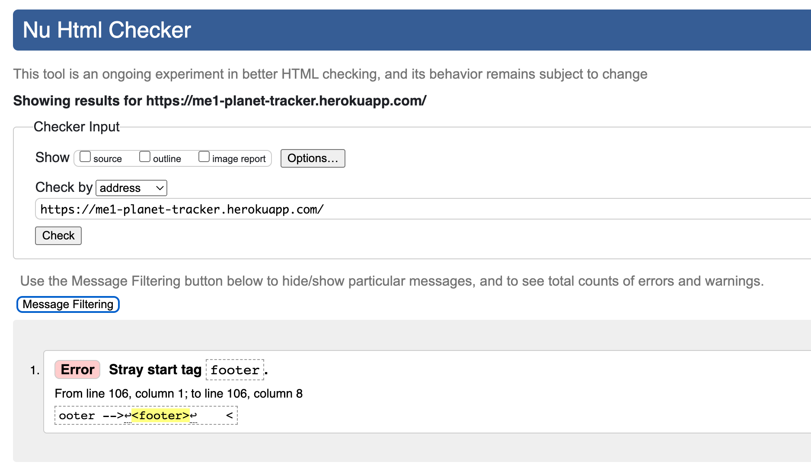
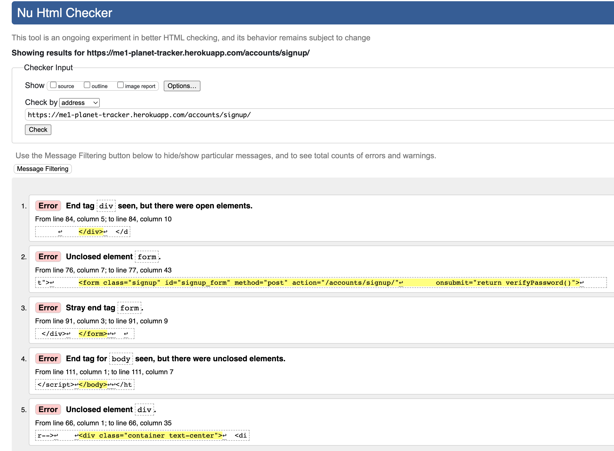

## Testing 

### Automated Testing - Python
When I first ran my automated Python tests, there was one statement missing in views.py and one statement missing in models.py:





The final test coverage is at 100%:



These tests can be found in my [planets app](https://github.com/StephHjar/me1-planet-tracker/tree/main/planets)

### Automated Testing - JavaScript
I also wrote automated tests using Jest for my JavaScript password validator, and all tests pass:



These tests can be found in my [js folder](https://github.com/StephHjar/me1-planet-tracker/tree/main/static/js/tests).

### Validator Testing - HTML
When I first ran my HTML code through the validator, some errors were found:

- 1 error on the home page: my ```<footer>``` tag was outside my ```<body>``` tag:


- 5 errors on the signup page, because the form was being opened in one ```<div>``` and closed in another:


- 13 errors on the planet list page:
[Link to PDF here](static/readme/html-validator-error3.pdf)
Some of these errors were caused by the form that was automatically generated by the [django-search-views package](https://pypi.org/project/django-search-views/). I updated the form to use crispy forms instead, and this resolved the errors.

- 5 errors on the add planet form, again because the form was being opened in one ```<div>``` and closed in another. 
[Link to PDF here](static/readme/html-validator-error4.pdf)

- CSS
  - No errors were found when passing through the official [(Jigsaw) validator](https://jigsaw.w3.org/css-validator/validator?uri=https%3A%2F%2Fvalidator.w3.org%2Fnu%2F%3Fdoc%3Dhttps%253A%252F%252Fcode-institute-org.github.io%252Flove-running-2.0%252Findex.html&profile=css3svg&usermedium=all&warning=1&vextwarning=&lang=en#css)

  ### Manual Testing