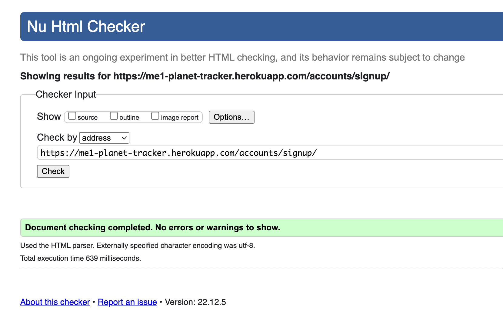

## Testing 

### Automated Testing - Python
When I first ran my automated Python tests, there was one statement missing in views.py and one statement missing in models.py:


The final test coverage is at 100%:


These tests can be found in my [planets app](https://github.com/StephHjar/me1-planet-tracker/tree/main/planets)

### Automated Testing - JavaScript
I also wrote automated tests using Jest for my JavaScript password validator, and all tests pass:


These tests can be found in my [js folder](https://github.com/StephHjar/me1-planet-tracker/tree/main/static/js/tests).

### Validator Testing - HTML
When I first ran my HTML code through the validator, some errors were found:

- 1 error on the home page: my ```<footer>``` tag was outside my ```<body>``` tag:


- 5 errors on the signup page, because the form was being opened in one ```<div>``` and closed in another:


- 13 errors on the planet list page:
[Link to PDF here](static/readme/html-validator-error3.pdf)
Some of these errors were caused by the form that was automatically generated by the [django-search-views package](https://pypi.org/project/django-search-views/). I updated the form to use crispy forms instead, and this resolved the errors.

- 5 errors on the add planet form, again because the form was being opened in one ```<div>``` and closed in another. 
[Link to PDF here](static/readme/html-validator-error4.pdf)

- 3 errors on the edit planet form: an unclosed div, and an extra ```</p>``` tag from a copy/paste error.
[Link to PDF here](static/readme/html-validator-error-5.pdf)

- 5 errors on the delete planet form: the same error as on previous pages, where a form was being closed in a different div than it was opened in.
[Link to PDF here](static/readme/html-validator-error-6.pdf)

Here are the final runs through the validator with no errors:
- 
- 
- [Planet list page - PDF](static/readme/html-validator-planet-list.pdf)
- [Add planet form - PDF ](static/readme/html-validator-add-planet.pdf)
- [Edit planet form - PDF](static/readme/html-validator-edit-planet.pdf)
- [Delete planet form - PDF](static/readme/html-validator-delete-planet.pdf)
- [Logout page- PDF](static/readme/html-validator-logout.pdf)

### Validator Testing - CSS
No errors were found when passing through the official [(Jigsaw) validator](https://jigsaw.w3.org/css-validator/):
- [CSS validator results - PDF](static/readme/css-validator.pdf)

### Validator Testing - JavaScript
No errors were found when passing through the official [JSHint validator](https://jshint.com/):


### Lighthouse Testing
I was receiving a console error due to my ```module.export``` at the bottom of my JavaScript file, which was necessary for Jest testing:

I resolved this by adding the following code to the bottom of the file instead:
```javascript
var module = module || {};
module.exports = funct;
```
Desktop testing scores were very high:


Mobile scores were significantly lower:

- [Here](static/readme/lighthouse-mobile-report.pdf) is the full PDF report.
- The major issues are:
  - Images don't have a fixed width or height: this is intentional to make the images & layout responsive.
  - It suggests eliminating 'render-blocking resources', but these are the Bootstrap, Cloudinary, FontAwesome, and Google Fonts files I am loading in the head of the page.
  - It suggests serving static assets with an efficient cache policy, but I am using Cloudinary to host my static files.


### Manual Testing

The site was tested manually by going through all CRUD screens and forms, and ensuring error validation and functionality. 

| Test Case | Pass? | Screenshot |
|-----------|-------|------------|
|Sign-up form: username is required|Yes||
|Sign-up form: password must be longer than 8 characters|Yes||
|Sign-up form: password must not be longer than 15 characters|Yes||
|Sign-up form: password is required|Yes||
|Login form: validation message shows when user logs in|Yes||
|Add planet form: name is required|Yes||
|Add planet form: validation message when planet is added|Yes||
|Edit planet form: validation message when planet is edited|Yes||
|Delete planet form: validation message when planet is deleted|Yes||
|Log out form: validation message when user logs out|Yes||

The site was tested on the following devices: MacBook Air, MacBook Pro, iPhone, and iPad. The site was tested in Chrome and Safari.

There was one major bug documented in my [Closed Issues on Github](https://github.com/StephHjar/me1-planet-tracker/issues?q=is%3Aissue+is%3Aclosed).